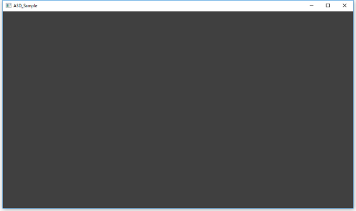
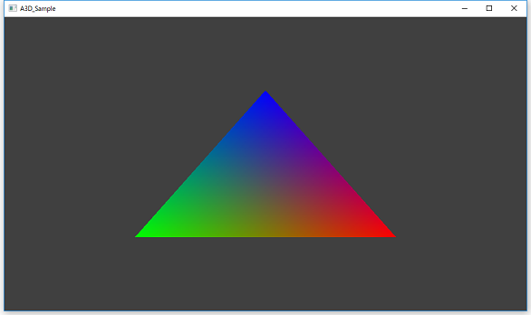
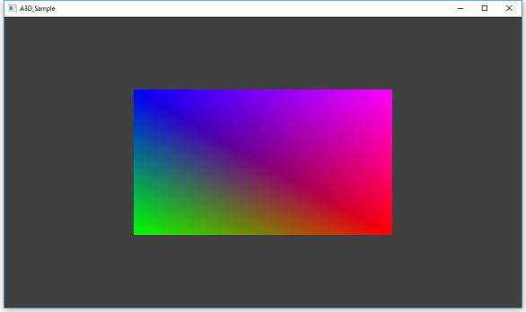
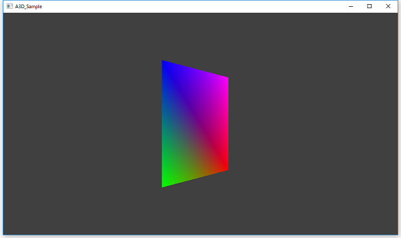
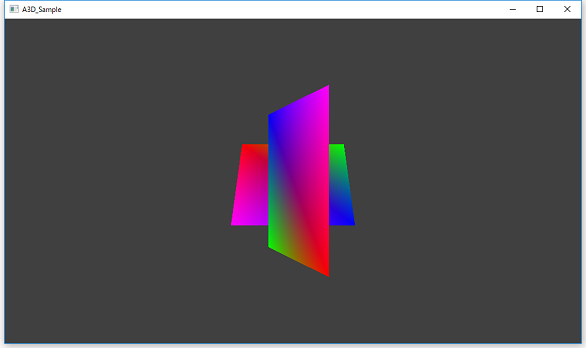
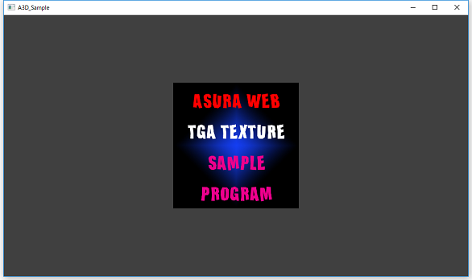
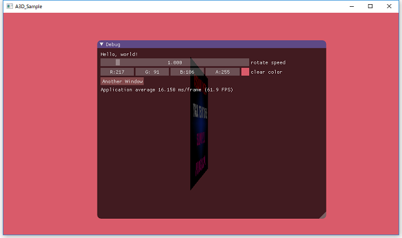
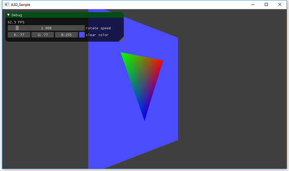

# a3d
Asura Rendering Hardware Interface Library  
This project is WIP  

## About
a3d はDirect3D12とVulkanをラップするための抽象化3Dグラフィックスライブラリです。  
主にゲームエンジンやツール作成するための足回りとして利用することを目的として開発を進めています。  

## Build  
ビルドするには予め以下のものをインストールしておく必要があります。
* Visual Studio 2015 Update 3  
* Windows SDK  
* Vulkan SDK  

ビルド方法についてですが，project/build.batを実行することで，binフォルダにスタティックライブラリが生成されます。  


## Integration  
組み込みするためには，次の2つの手順が必要です。
* ヘッダファイルをインクルードする  
* スタティックライブラリをリンクする  

ヘッダファイルは includeフォルダにあります。プログラムで，次のようにa3d.hファイルをインクルードします。  
```
#include <a3d.h>
```

スタティックライブラリは，binフォルダ下にDirect3D12版とVulkan版がそれぞれ別に存在します。  
ご使用したい環境に合わせてリンクするファイルを選択してください。  
Direct3D12版を使用する場合は次のファイルをリンクする必要があります。  

* a3d_d3d12d.lib (デバッグ版)
* a3d_d3d12.lib  (リリース版)
* d3d12.lib
* dxgi.lib

Vulkan版を使用する場合は次のファイルをリンクする必要があります。  

* a3d_vkd.lib (デバッグ版)
* a3d_vk.lib  (リリース版)
* vulkan-1.lib 

sampleフォルダ下に組み込み例があるので，組み込み方法が分からない場合は参考にしてください。  


## Documents
docフォルダ下にAPIリファレンスがあります。  
* [API Document](./doc/a3d_api.chm)  


## Samples
sampleフォルダ下にa3dライブラリを使ったサンプルがあります。  

* [ClearColor](./sample/001_ClearColor/code "ClearColor")  
画面をクリアするサンプルです。  
  

* [DrawPolygon](./sample/002_DrawPolygon/code "DrawPolygon")  
ポリゴンを描画するサンプルです。  
  

* [DrawIndexed](./sample/003_DrawIndexed/code "DrawIndexed")  
インデックスバッファを用いてポリゴンを描画するサンプルです。  
  

* [ConstantBuffer](./sample/004_ConstantBuffer/code "ConstantBuffer")  
定数バッファを用いてポリゴンを回転させるサンプルです。  
  

* [DepthBuffer](./sample/005_DepthBuffer/code "DepthBuffer")  
深度バッファを用いて手前と奥のポリゴンを表示するサンプルです。  
  

* [DrawTexture](./sample/006_DrawTexture/code "DrawTexture")  
テクスチャを描画するサンプルです。  
  

* [ImGuiSample](./sample/007_ImGuiSample/code "ImGuiSample")  
ImGuiを用いたサンプルです。  
  

* [RenderingTexture](./sample/008_RenderingTexture/code "RenderingTexture")  
レンダリングテクスチャを表示するサンプルです。  
  

## License
This software is licensed under the MIT License, see LICENSE for more information.

