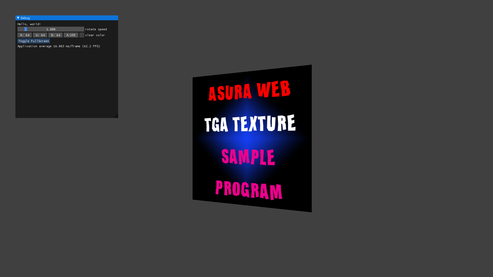
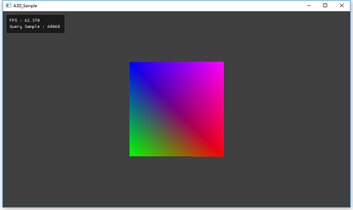

# a3d
Asura Rendering Hardware Interface Library  
This project is WIP.  

VS2015 [](https://ci.appveyor.com/project/ProjectAsura/asura-sdk)  
VS2017 [](https://ci.appveyor.com/project/ProjectAsura/asura-sdk-6x1dn)  

## About
a3d is an abstraction 3D graphics library for wrapping Direct3D12 and Vulkan.  
We are promoting development aiming mainly to use as a foundation for game engines and tools.  
Now supported following graphics APIs.
* Direct3D 11
* Direct3D 12
* Vulkan


a3d はDirect3D12とVulkanをラップするための抽象化3Dグラフィックスライブラリです。  
主にゲームエンジンやツールの基盤としての利用を目指して開発を進めています。  
現在以下のグラフィックスAPIに対応しています。
* Direct3D 11
* Direct3D 12
* Vulkan


## License
This software is licensed under the MIT License, see LICENSE for more information.
[License](./LICENSE "License")  


このソフトウェアはMITライセンスです。詳細についてはLICENSEをご覧ください。
[License](./LICENSE "License")  

## Build  
In order to build, you need to install the following software and libraries.
* MS Build 14.0
* Visual Studio 2015 Update 3
* Windows SDK
* Vulkan SDK

There are two ways to build a3d. One is to open solution file(*.sln) from the Visual Studio and build, otherway is batch build.
For batch build, use MSBuild 14.0. Go to project folder, run build.bat. After build static libraries are created in the bin folder.
To build from the solution file, Go to project/d3d12 folder and project/vulkan folder, respectively, open the a3d.sln file in Visual Studio and execute the build.


ビルドするには予め以下のものをインストールしておく必要があります。
* MSBuild 14.0
* Visual Studio 2015 Update 3  
* Windows SDK  
* Vulkan SDK  

ビルド方法についてですが，バッチビルドと個別にソシューションファイルを開いてビルドする方法があります。
バッチビルドでは，MSBuild 14.0を使用します。project/build.batを実行することで，binフォルダにスタティックライブラリが生成されます。  
ソリューションファイルからビルドするには，project/d3d12フォルダと，project/vulkanフォルダにあるa3d.slnファイルをVisual Studioで読み込みビルドを実行してください。  


## Integration  
In order to integration, the following two steps
* Include header file
* Link static libaries

The header file is in the include folder. In the program, include the a3d.h file as follows.
```cpp
#include <a3d.h>
```


組み込みするためには，次の2つの手順が必要です。
* ヘッダファイルをインクルードする  
* スタティックライブラリをリンクする  

ヘッダファイルは includeフォルダにあります。プログラムで，次のようにa3d.hファイルをインクルードします。  
```cpp
#include <a3d.h>
```
For the static library, the Direct3D12 version and the Vulkan version exist separately under the bin folder.
Please select the file to link according to the environment you want to use.
To use Direct3D12 version, you need to link the following files.


* a3d_d3d12d.lib (For Debug version)
* a3d_d3d12.lib  (For Release version)
* d3d12.lib
* dxgi.lib

To use Vulkan version, you need to link the following files.

* a3d_vkd.lib (For Debug version)
* a3d_vk.lib  (For Release version)
* vulkan-1.lib 

There is a example to integration under the "sample" folder, please see it.  


スタティックライブラリは，binフォルダ下にDirect3D12版とVulkan版がそれぞれ別に存在します。  
ご使用したい環境に合わせてリンクするファイルを選択してください。  
Direct3D12版を使用する場合は次のファイルをリンクする必要があります。  

* a3d_d3d12d.lib (デバッグ版)
* a3d_d3d12.lib  (リリース版)
* d3d12.lib
* dxgi.lib

Vulkan版を使用する場合は次のファイルをリンクする必要があります。  

* a3d_vkd.lib (デバッグ版)
* a3d_vk.lib  (リリース版)
* vulkan-1.lib 

sampleフォルダ下に組み込み例があるので，組み込み方法が分からない場合は参考にしてください。  

### Initialization
First of all, you need to pass a memory allocator to the library. The memory allocator inherits the a3d::IAllocator interface and needs to be implemented by the user. A simple implementation example is as follows.  

まずは，ライブラリにメモリアロケータを渡す必要があります。メモリアロケータはa3d::IAllocatorインタフェースを継承してユーザーが実装する必要があります。単純な実装例は次のようになります。  

```cpp
class Allocator : a3d::IAllocator
{
public:
    void* Alloc(size_t size, size_t alignment) noexcept override
    {
        #if A3D_IS_WIN
            return _aligned_malloc(size, alignment);
        #else
            return aligned_alloc(alignment, size);
        #endif
    }

    void* Realloc(void* ptr, size_t size, size_t alignment) noexcept override
    {
        #if A3D_IS_WIN
            return _aligned_realloc(ptr, size, alignment);
        #else
            auto allocSize = a3d::RoundUp(size, alignment);
            return realloc(ptr, allocSize);
        #endif
    }

    void Free(void* ptr) noexcept override
    {
        #if A3D_IS_WIN
            _aligned_free(ptr);
        #else
            free(ptr);
        #endif
    }
} g_Allocator;

```


The memory allocator is passed to the library using the a3d :: InitSystem () method. Implementation examples are as follows.  

メモリアロケータはa3d::InitSystem()メソッドを使って，ライブラリに渡します。実装例は次の通りです。

```cpp
a3d::SystemDesc desc = {};
desc.pAllocator = &g_Allocator;

if (!a3d::InitSystem(&desc))
{ return false; }
```

### Finalization
Before exit the a3d library on terminate process, it is necessary to dispose all objects. To destroy the object, release processing is executed by calling the a3d::IReference::Release() method.  
With all objects destroyed, call the a3d::TermSystem() method. By calling this method, the memory allocator registered by the a3d::InitSystem() method is set to nullptr.

a3dライブラリを終了させる前に，全てのオブジェクトを破棄しておく必要があります。オブジェクトの破棄はa3d::IReference::Release()メソッドを呼び出すことにより解放処理が実行されます。  
全てのオブジェクトが破棄されている状態で，a3d::TermSystem()メソッドを呼び出しを行います。このメソッドを呼び出すことで，a3d::InitSystem()メソッドで登録したメモリアロケータがnullptrに設定されます。  

```cpp
a3d::TermSystem();
```

After a3d::TermSystem() call, please do not call any a3d's method, because of library may cause undefined behaviors.

a3d::TermSystem()呼び出し以後は，a3dライブラリのメソッドを呼び出しを行うと不定動作を起こす可能性がありますので呼び出しないようにお願い致します。  


## Samples
There is a example program using the a3d library under the sample folder.  

sampleフォルダ下にa3dライブラリを使ったサンプルがあります。  

* [ClearColor](./sample/001_ClearColor/src "ClearColor")  
Sample to clear the screen.  
画面をクリアするサンプルです。  
  

* [DrawPolygon](./sample/002_DrawPolygon/src "DrawPolygon")  
Sample to draw a polygon.  
ポリゴンを描画するサンプルです。  
  

* [DrawIndexed](./sample/003_DrawIndexed/src "DrawIndexed")  
Sample to draw a polygon with index buffer.  
インデックスバッファを用いてポリゴンを描画するサンプルです。  
  

* [ConstantBuffer](./sample/004_ConstantBuffer/src "ConstantBuffer")  
This is a sample that rotates a polygon using a constant buffer.  
定数バッファを用いてポリゴンを回転させるサンプルです。  
  

* [DepthBuffer](./sample/005_DepthBuffer/src "DepthBuffer")  
Sample that displays polygons using a depth buffer.  
深度バッファを用いて手前と奥のポリゴンを表示するサンプルです。  
  

* [DrawTexture](./sample/006_DrawTexture/src "DrawTexture")  
Sample to draw a texture.  
テクスチャを描画するサンプルです。  
  

* [ImGuiSample](./sample/007_ImGuiSample/src "ImGuiSample")  
Sample to use Imgui.  
ImGuiを用いたサンプルです。  
  

* [RenderingTexture](./sample/008_RenderingTexture/src "RenderingTexture")  
Sample to display rendering texture.  
レンダリングテクスチャを表示するサンプルです。  
  

* [FullScreen](./sample/009_FullScreen/src "FullScreen")  
Sample to toggle full screen mode.  
フルスクリーンモードを切り替えるサンプルです。  
  

* [OcclusionQuery](./sample/010_OcclusionQuery/src "OcclusionQuery")  
Sample to use Occlussion query.  
オクルージョンクエリを使用するサンプルです。  
  


## Documents
docフォルダ下にAPIリファレンスがあります。  
* [API Document](./doc/a3d_api.chm)  (JP Only)


